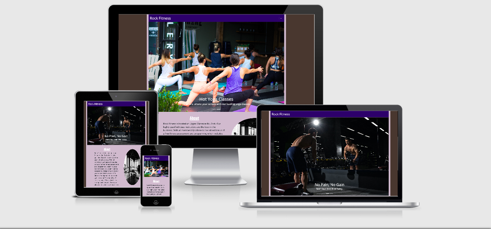
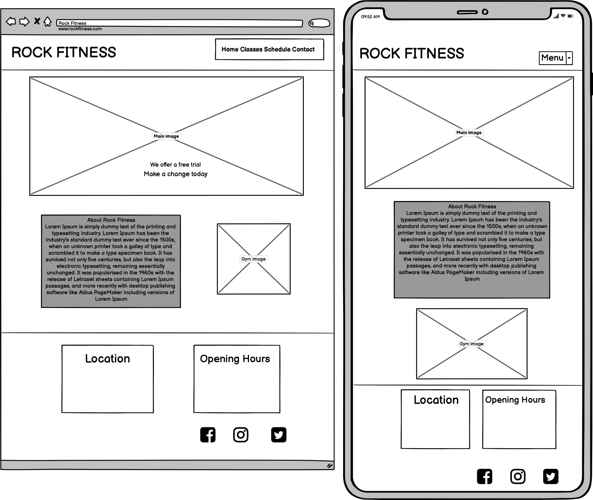
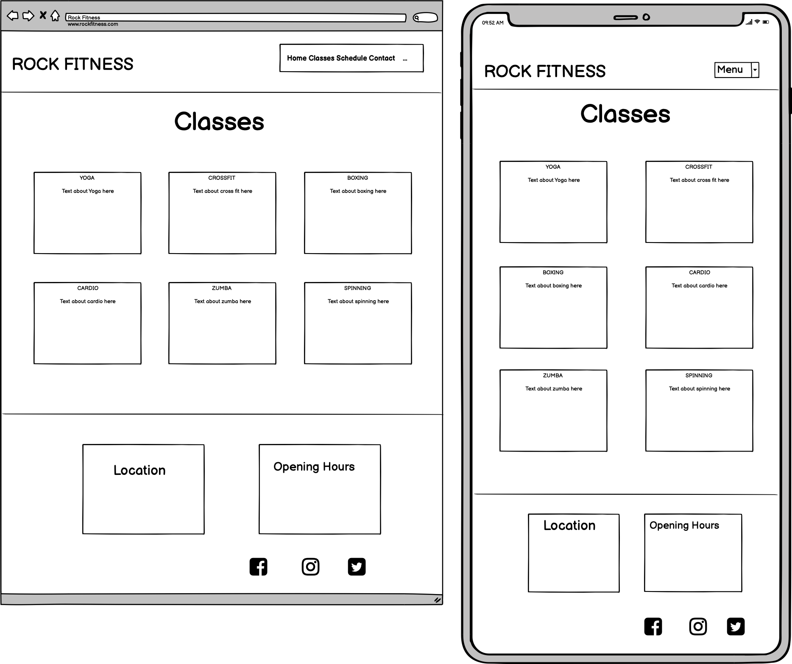
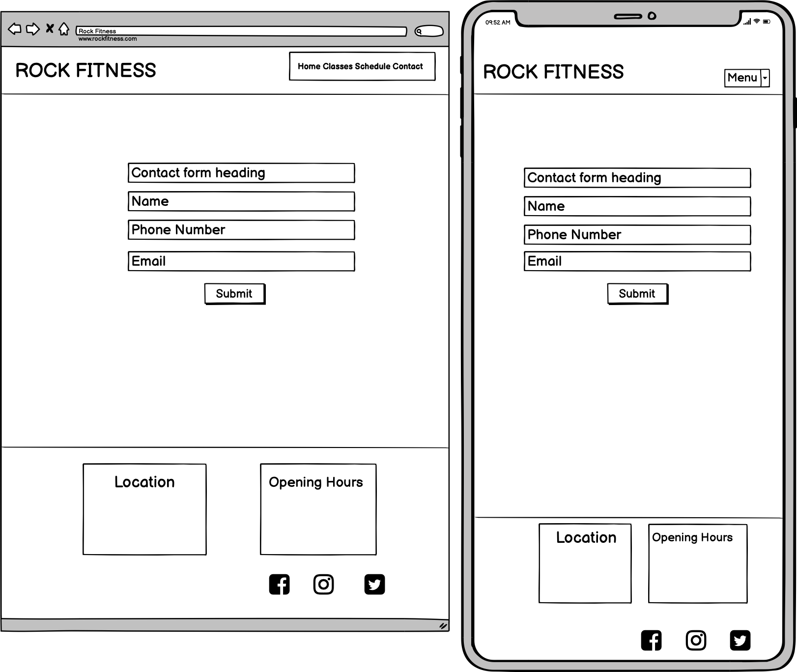
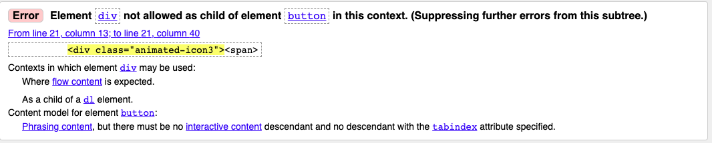
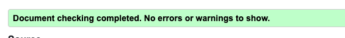

# Rock Fitness Gym

[Link to live project](https://sophieboyle1.github.io/Milestone-1/)

# Milestone Project 1

## Project Summary
This Website was created for the sole purpose of completing the first Milestone Project for the Code Institute's Full Stack Developer course. 
It was built using the knowledge gained from the HTML, CSS and User Centric Design modules.

# Contents
* [User Experience Design](#User-Experience-Design)
  * [User Stories](#User-Stories)
  * [Structure](#Structure)
  * [Design](#Design)
    * [Colour Scheme](#Colour-Scheme)
    * [Typography](#Typography)
    * [Wireframes](#Wireframes)
* [Features](#Features)
* [Technologies Used](#Technologies-Used)
* [Testing](#Testing)
* [Deployment](#Deployment)
* [Credits](#Credits)

# User Experience Design

## Target Audience:
* Beginners to fitness
* Young Adults with busy lives
* Groups of friends 
* Students 

## User Stories
* As a user I want to see clearly where the gym is located and if there is parking available.
* As a user I want to see the gyms opening times during the week and at weekends.
* As a user I want to see what kinds of classes the gym has available.
* As a user I want a mobile friendly site so that I can browse quickly and easily.
* As a user I want to be able to easily navigate throughout the site to find content.
* As a user I want to know what types of workout equipment that the gym has available.
* As a user I want to contact the gym so I can request more information.

## Structure

## Design
### Colour Scheme
* The two main colours used are a violet  and a light pink  as I felt these colours would suit a gym website,and also matched the images and fonts I chose. The violet and and light pink shade should compliment each other without being over powering to the eyes.
* I also wanted to use a darker brown  for the body, to make the purple shades pop.
* Both colours were checked for contrast using the Webaim contrast checker.

## Typography
* I used a mix of the font Teko, with Open Sans to create balance and structure throughout the website, which i feel pairs very well.

## Wireframes
Home Page 
 
Classes Page 
 
Contact Page 
 

Wireframes for Mobile, Tablet & Desktop
* [Home Page](https://github.com/sophieboyle1/Milestone-1/tree/master/assets/images/wireframes/wireframe-home.png)
* [Classes Page](https://github.com/sophieboyle1/Milestone-1/tree/master/assets/images/wireframes/wireframe-classes.png)
* [Contact Page](https://github.com/sophieboyle1/Milestone-1/tree/master/assets/images/wireframes/wireframe-contact.png)

## Differences between final design and original wireframes:
### Home page: 

Orginially I had planned to list my navigation menu horizontaly, but later decided to add a hamburger style nav bar from bootstrap and I found it was easier to navigate the menu items from mobile devices, was was much more pleasing to the eye. 
On all devices it was decided to have the first image act as a hero image for the page to grab the users attention, which I later decided to add a carousel feature to add more dimension.

# Features

## Existing Features
* Responsive on all devices
* Navigation Menu fixed at top on all devices to provide users with quick and easy access to the other pages of the site.
* A Contact fom can be completed on the contact.html page and used in order to contact the gym with any queries.
* Carousel gallery on home page to illustrate members working out and participating in group classes.

## Features Left to Implement
* Customer reviews.
* Private Training sessions offered with booking system.
* Ability to rent sections of the gym for larger groups as part of the contact form.

# Technologies Used
* [Html](https://www.w3schools.com/html/) - Hyper Text Markup Language, used for creating the website.
* [Css](https://www.w3schools.com/css/) - Cascading Style Sheet, used for styling the website.
* [Bootstrap](https://getbootstrap.com/) - Bootstrap grid system, navigation bar and carousel. 
* [Font Awesome](https://fontawesome.com/) - Font awesome Icons are used for the Social media links contained in the Footer section of the website, Also for the information in the text boxes on homepage.
* [Google Fonts](https://fonts.google.com/) - Google fonts are used in the project to import the Teko and Open Sans.
* [Balsamiq](https://balsamiq.com/) – Used for creating the wireframes.
* [Git](https://git-scm.com/) - Git is used as version control software to commit and push code to the GitHub repository where the source code is stored.
* [GitHub](https://github.com/) - GithHub is the hosting site used to store the source code for the Website 
* [Gitpod](https://www.gitpod.io/) - Development environment where the site was built.
* [Webaim contrast checker](https://webaim.org/resources/contrastchecker/) - Used to check the contrast between the various colours used.
* [Chrome Dev Tools](https://developers.google.com/web/tools/chrome-devtools) - Used throughout the development of the website to quickly see changes and find problems.
* [W3C HTML validator](https://validator.w3.org/) - Used to validate code.
* [W3C CSS validator](https://jigsaw.w3.org/css-validator/) - Used to validate code.
* [Coolors](https://coolors.co/) - Used for selecting complimentary colour palettes.
* [Unsplash](https://unsplash.com/) - Found my images here used throughout the website.

# Testing

## Code Validators
* CSS Stylesheet was run through the W3C CSS Validator and showed no errors.
* All HTML code was passed through the W3C Markup Validator, and showed a common error within the nav bar.  
 
* I reffered back to the original bootstrap nav bar code and decided to input a different button class. One that was the correct child element to give all pages a better hamburger menu.
* I ran the code again through W3C Markup Validator and it showed NO errors.
 
* As a user I want to see the gyms opening times during the week and at weekends. -  Text Box is clearly defined to show the Gyms opening times for the weekdays and weekends.  
* As a user I want to see what kinds of classes the gym has available. - Testing was performed to ensure that all the types of classes are listed and fully responsive on all devices. 
* As a user I want a mobile friendly site so that I can browse quickly and easily. - This website was developed as a mobile first web site, ensuring mobile users an excellent user experience.  
* As a user I want to be able to easily navigate throughout the site to find content. - Testing was performed on all Navigation links to ensure users can easily navigate the Website.  
* As a user I want to know what types of workout equipment that the gym has available. - Full text box was tested to ensure it states all equipment and facilities available.  
* As a user I want to contact the gym so I can request more information. - Contact page is provided and is simple and easy to use. 

## Issues and Resolutions
* Nav bar issue on all pages. It was resolved by changing part of the code.
* Spelling mistakes were found when proof reading, these were corrected.
* Photo alignment issue on Classes page, this was fixed by adding bootstrap and using code from W3 website.
* Images on classes page were different sizes, these were fixed by adding height and width in css style.

# Deployment

## Project Creation
* This website was created in the Gitpod development environment. After installing the Gitpod extension for Chrome web browser and creating a new repository in GitHub using the Code Institute template,the green Gitpod button was used to initialise the repository in Gitpod. The following commands were used throughout the project, git add and git commit were used to store the work in the local Gitpod environment, git push would then be used to push the commits to the GitHub repository. From here the website could then deployed to Git Pages.

## Using Github Pages
* Navigate to the GitHub [Repository:](https://github.com/sophieboyle1/Milestone-1)
* Go to settings
* Scroll down to Git Hub Pages section
* Select 'Master Branch' as the source.
* Click Save
* Click on the link to go to the live deployed page.

## Run Local 
* Navigate to the GitHub [Repository:](https://github.com/sophieboyle1/Milestone-1)
* Click the Code drop down menu.
* Click the clipboard icon to copy the url provided
* Open your developement editor of choice and open a terminal window in a directory of your choice.
* Use "git clone" and paste the copied url after it.
* A clone of the project will be created locally on your machine.

# Credits
## Code 
* [Bootstrap Nav Bar with Links](https://getbootstrap.com/docs/4.5/components/navbar/). Bootstrap navbar used with some modifications and also CSS animations.
* [Bootstrap Carousel with controls](https://getbootstrap.com/docs/4.5/components/carousel/). Bootstrap carousel used with some modifications.
* W3 Schools [How To Place Images Side by Side](https://www.w3schools.com/howto/howto_css_images_side_by_side.asp). Code added to both HTML and CSS to align images.
* Bootstrap Grid System [Grid system](https://getbootstrap.com/docs/4.0/layout/grid/) Used to create a Responsive website using the grid system.

## Content 
* Content for discription of classes was found on [Wikipedia](https://www.wikipedia.org/) by typing in the Name of each Class.
* Rest of the content was written by myself.

## Media 
* Images were sourced by the website [Unsplashed](https://unsplash.com/) 

## Acknowledgements
* I'd like to thank my mentor Spencer Barriball for his patience and guidance throughout my project.
* My tutor Roman at the Kerry ETB for all the support he gives daily.
* All at Code Institute and Tutor support.

