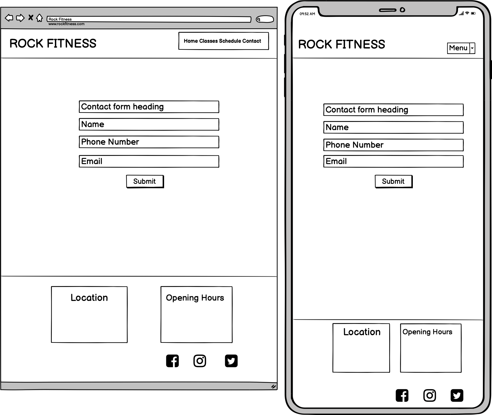

# Rock Fitness Gym

[Link to live project](https://github.com/sophieboyle1/Milestone-1.git/index.html)

# Milestone Project 1

## Project Summary
This Website was created for the sole purpose of completing the first Milestone Project for the Code Institute's Full Stack Developer course. 
It was built using the knowledge gained from the HTML, CSS and User Centric Design modules.

# Contents
* [User Experience Design](#User-Experience-Design)
  * [User Stories](#User-Stories)
  * [Structure](#Structure)
  * [Design](#Design)
    * [Colour Scheme](#Colour-Scheme)
    * [Typography](#Typography)
    * [Wireframes](#Wireframes)
* [Features](#Features)
* [Technologies Used](#Technologies-Used)
* [Testing](#Testing)
* [Deployment](#Deployment)
* [Credits](#Credits)

# User Experience Design

## Target Audience:
* Beginners to fitness
* Young Adults with busy lives
* Groups of friends 
* Students 

## User Stories
* As a user I want to see clearly where the gym is located and if there is parking available.
* As a user I want to see the gyms opening times during the week and at weekends.
* As a user I want to see what kinds of classes the gym has available.
* As a user I want a mobile friendly site so that I can browse quickly and easily.
* As a user I want to be able to easily navigate throughout the site to find content.
* As a user I want to know what types of workout equipment that the gym has available.
* As a user I want to contact the gym so I can request more information.

## Structure

## Design
### Colour Scheme
* The two main colours used are a violet  and a light pink  as I felt these colours would suit a gym website,and also matched the images and fonts I chose. The violet and and light pink shade should compliment each other without being over powering to the eyes.
* I also wanted to use a darker brown  for the body, to make the purple shades pop.
* Both colours were checked for contrast using the Webaim contrast checker.

## Typography
* I used a mix of the font Teko, with Open Sans to create balance and structure throughout the website, which i feel pairs very well.

## Wireframes
Home Page 
 
Classes Page 
 
Contact Page 
 

# Features

## Existing Features
* Responsive on all devices
* Navigation Menu fixed at top on all devices to provide users with quick and easy access to the other pages of the site.
* A Contact fom can be completed on the contact.html page and used in order to contact the gym with any queries.
* Contact Form with dropdown menu for subject line.
* Carousel gallery on home page to illustrate members working out and participating in group classes.

## Features Left to Implement
* Customer reviews.
* Private Training sessions offered with booking system.
* Ability to rent sections of the gym for larger groups as part of the contact form.

# Technologies Used
* [Html](https://www.w3schools.com/html/) - Hyper Text Markup Language, used for creating the website.
* [Css](https://www.w3schools.com/css/) - Cascading Style Sheet, used for styling the website.
* [Bootstrap](https://getbootstrap.com/) - Bootstrap grid system, navigation bar and carousel. 
* [Font Awesome](https://fontawesome.com/) - Font awesome Icons are used for the Social media links contained in the Footer section of the website, Also for the information in the text boxes on homepage.
* [Google Fonts](https://fonts.google.com/) - Google fonts are used in the project to import the Teko and Open Sans.
* [Balsamiq](https://balsamiq.com/) – Used for creating the wireframes.
* [Git](https://git-scm.com/) - Git is used as version control software to commit and push code to the GitHub repository where the source code is stored.
* [GitHub](https://github.com/) - GithHub is the hosting site used to store the source code for the Website 
* [Gitpod](https://www.gitpod.io/) - Development environment where the site was built.
* [Webaim contrast checker](https://webaim.org/resources/contrastchecker/) - Used to check the contrast between the various colours used.
* [Chrome Dev Tools](https://developers.google.com/web/tools/chrome-devtools) - Used throughout the development of the website to quickly see changes and find problems.
* [W3C HTML validator](https://validator.w3.org/) - Used to validate code.
* [W3C CSS validator](https://jigsaw.w3.org/css-validator/) - Used to validate code.
* [Coolors](https://coolors.co/) - Used for selecting complimentary colour palettes.
* [Unsplash](https://unsplash.com/) - Found my images here used throughout the website.

# Testing
* 

# Deployment

## Project Creation
* This website was created in the Gitpod development environment. After installing the Gitpod extension for Chrome web browser and creating a new repository in GitHub using the Code Institute template,the green Gitpod button was used to initialise the repository in Gitpod. The following commands were used throughout the project.
 

